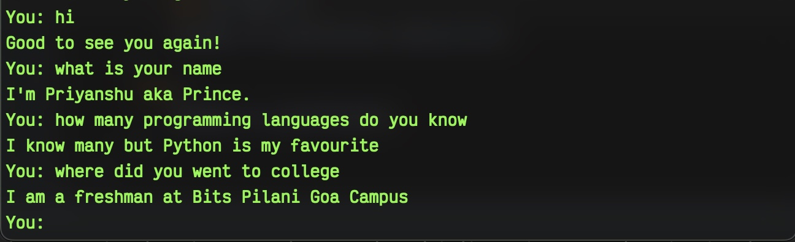

# AI Chat-bot using tensorflow #
## Preview

 
### Steps to install this locally

Make sure you have Python installed on your system. 

- clone the repository into your local system.

        git clone https://github.com/kumarpriyanshu2k2/CV_Volume_Controller.git

- go to the directory in which you have cloned this project.

        cd ./CV_Volume_Controller
    
- install the required libraries using the following command:

        pip install -r requirements.txt
    
now you have installed all the required files, you can 
- execute main.py

        python3 main.py

- To exit
    - type "quit"

